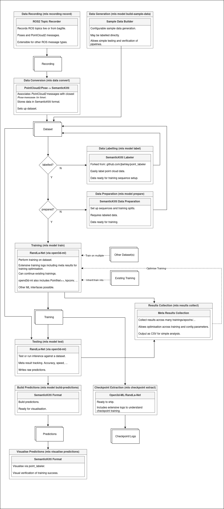

# ML-Suite

## Quick overview


The ML-Suite (`mls`) basically wraps `open3d` and its RandLa-Net implementation in a hopefully easy to use and intuitive application. During my work with LIDAR based sensor data I ran into the problem of having to distinguish large sets of data while wanting to change them predictably. And really, wanting to do that easily. Store training sets alongside trainings and predictions, and merge in between. `mls` supports many datasets/trainings including easy operations on them. And more.

None of this is rocket science. Rather it's a creative approach to increase effectiveness and speed of doing things that are *themselves* complex. It's simply aimed at improving overall effectiveness by factoring away data admin tasks in a graceful and predictable way, more or less. It's a little more than that, but that describes it quite well.

Labelling is included in the app and handed over to jbehley's awesome `point_labeler` with some slight modifications.

Trainings can be updated or based on existing trainings with extensive logging to understand the evolution of a learnt model and therefore to better compare and more effectively tune parameters.

We can record ROS topics and thereby easily listen to running ROS applications giving a rather native integration to sensor data input and bagfile based recordings. This is more of an optional. If you're not using ROS. You won't need to install it. You just *could*.

All generated data can be organised and stored in snapshots allowing easily switching between entirely different training contexts (utilises `rsync` including a progress bar for sanity). Snapshots may be merged and annotated, as well.

Datasets and predictions can easily be visualised and compared.

Complex trainings and workflows can be scripted in Jinja2 enabled script files.

For larger trainings. It's important to understand data across several trainings well. To this end using `mls results collect` we generate a CSV comparing all relevant training data including loss and accuracy for training, testing, and inference. The data included is quite comprehensive but also easily extensible.

The `node` module allows integration back into ROS. By spinning up a publication node responsible for sending point cloud and position data via ROS topics. The inference node can then be specified a given checkpoint and perform realtime inference with configurable labels and output topics. The visualisation node will listen on *those* topics and colour them in as configured.

This allows a simple and quick cycle for a more realistic and visual inference output.

Overall. This made my work with training based on ROS LIDAR data extremely fast and easily tunable.

At time of writing. This handles RandLa-Net via `open3d` using semantic kitti based datasets. Specifically 3D point cloud based data with additional features. However, it's extensible and/or will be made so once it needs to more.

## Initial setup
In the below I'm assuming this function for brevity. I'm also assuming the `ml-suite` to live at `~/ml-suite`. Change as required.
```
cat <<EOF >> ~/.bashrc

# github.com/john-philipp/ml-suite home dir.
export MLS_HOME=$HOME/ml-suite

# Shorthand from anywhere.
function mls () { 
    ( cd ${MLS_HOME} && python3 . \$@ )
}
EOF

# Reload profile.
exec bash
```
# Installation

It makes sense to set these up in its own virtual environment. I've had some fun with some Python versions and packages. The below works for me on Ubuntu 22.04:
```
pyenv virtualenv 3.10.12 mls-env
pyenv activate mls-env
```

Dependencies are required selectively based on functionality used. On handler invocation missing dependencies will show themselves. For basic functionality use:
```
pip install -r requirements/base.txt
```

You should now be able to call the application. All helps should work now. But we need more dependencies to make the remaining handlers work.

You can see a full nested help by calling:
```
mls misc make-docs | less
```

## Install point labeler
For labelling and visualisation you require the `point_labeler` in a patched version. I looked at visualisation using `open3d` but found the `point_labeler` to be more intuitive and efficient, especially regarding larger datasets. It may seem like a heavy-handed inclusion and I appreciate that. It's with intent.
```
# Lifted from the github page.
sudo apt install git libeigen3-dev libboost-all-dev qtbase5-dev libglew-dev
sudo apt install python-pip
sudo pip install catkin_tools catkin_tools_fetch empy

# Get point_labeler source. Forked from jbehley.
cd ~
git clone https://github.com/john-philipp/point_labeler.git
cd point_labeler

# Build.
cmake -S . -B build
cmake --build build

# Add env var and reload session. Alternatively, export each time.
echo export POINT_LABELER_PATH=~/point_labeler >> ~/.bashrc
```
A quick note on using the labeler on its own. Make sure you're running it from the bin directory. That is change into that directory to use *that* settings file. Otherwise, the settings don't apply and nor do you see logs telling you which are. I found this somewhat implicit. In `mls`, it's factored away from you. Still, these things pay to know.

## CUDA

You don't strictly need to install CUDA for training. PyTorch should default back to CPU based training if it doesn't detect CUDA enabled devices. The expected slowdown is massive. So *should* you, no. *Could* you, apparently.

You can follow this guide: https://docs.nvidia.com/cuda/cuda-installation-guide-linux

That being said. I found it somewhat misleading and more difficult to follow than it really ought to be at times. I'll be running through the installation again. And if I find I can add something sanity inducing. I shall add it here.

I tested this application with CUDA 11.5 and 12.4. Though I expect other versions to work, as well.

## Install open3d/pytorch

To include capacity to train and test and anything `open3d`:
```
pip install -r requirements/open3d.txt
```
I've tested this against CUDA 11.5 and 12.4. It's likely other versions will work, too. If you haven't installed CUDA. Training/testing should still be possible. However, it will fall back to CPU, which will be very slow comparatively.

## (Optional) Recording from ROS topics

Basically, follow these steps: https://docs.ros.org/en/humble/Installation.html

### Set locale

```
locale  # check for UTF-8

sudo apt update && sudo apt install locales
sudo locale-gen en_US en_US.UTF-8
sudo update-locale LC_ALL=en_US.UTF-8 LANG=en_US.UTF-8
export LANG=en_US.UTF-8

locale  # verify settings
```

### Set up sources

```
sudo apt install software-properties-common
sudo add-apt-repository universe
sudo apt update && sudo apt install curl -y
sudo curl -sSL https://raw.githubusercontent.com/ros/rosdistro/master/ros.key -o /usr/share/keyrings/ros-archive-keyring.gpg
echo "deb [arch=$(dpkg --print-architecture) signed-by=/usr/share/keyrings/ros-archive-keyring.gpg] http://packages.ros.org/ros2/ubuntu $(. /etc/os-release && echo $UBUNTU_CODENAME) main" | sudo tee /etc/apt/sources.list.d/ros2.list > /dev/null
sudo apt update -y
sudo apt upgrade -y
```

### Install ROS2 humble

```
sudo apt install ros-humble-ros-base -y

# Reload session and venv.
pyenv deactivate
exec bash
pyenv activate mls-env

# Verify.
python3 -c "import rclpy; print('rclpy is installed')"

```

That should be everything you need.


## Quick workflow

We should now be able to build some sample data, label, train, test, and build predictions.

#### Building sample data
To build some labelled sample data in semantic kitti format, we can use:
```
mls model build-sample-data
```
We can control our sample data using `config/sample-data-config.yaml`, but for right now defaults are fine. We should now see a dataset in `_generated/02-datasets`:
```
dir _generated/02-datasets

# Output:
0001_7180
```
The index is deterministic and monotonically increasing by one. The last four characters are random and avoid accidental overwrites when merging datasets from other locations. Notably, in such a scenario there is currently no auto resolution of indexes.

Out dataset currently only consists of a single sequence: `.full`. This sequence is used for labelling. Once labelled we split open this sequence using `mls model prepare`.

#### Labelling the data

In order to label we call:
```
mls model label
```
This opens the `.full` sequence in the `point_labeler`. Note that sample data comes pre-labelled. You can select `Visuals | show single scan` and will be able to drag you mouse along the bar on the bottom to see individual bins. The square with walls is put together out of many different randomised locations each seeing only a certain perspective of the whole to allow for a somewhat realistic learning experience. The FOV max distance and vision cone can be controlled in `config/sample-data-config.yaml`.

#### Preparing the sequences

Training on sematic kitti based datasets requires us to organise our data in sequences. Which we organise again into splits: training, validation, test, and sparse. The former three are normal AI based sequence names. And usually populated in the ratio `7:2:1`. The idea is that they don't overlap and allow us to validate and test against unseen data.

The latter sequence `sparse` is a sequence that based on position attempts to reduce the overall data to a meaningful subset that covers the entire area more representatively. It's useful when quickly wanting to yield a meaningful prediction across large datasets severely reducing the interruption of the development workflow.

Since we're just testing basics we can use defaults:
```
mls model prepare
```
This should yield 10 sequences in our dataset directory in `_generated/02-datasets`. Note that when re-labelling. This step requires repeating. Data is copied into sequences. Not linked.

If you have CUDA installed and would like to track GPU utilisation as part of your training and testing:
```
pip install -r requirements/nvidia_smi.txt
```
This is optional, so kept separate. The code won't fail, but it's a sensible addition for GPU resource utilisation tracking and tuning.

#### Training, testing, and predictions

We can now train, test, and predict as follows:
```
# Train our model.
mls model train

# Test (generates predictions).
mls model test

# Build prediction datasets.
mls model build-predictions

# Visualise predictions
mls visualise predictions
```

The end result will likely be quite inaccurate (due to a low number of epochs and using the sparse split for training), but that's the basic workflow. You can compare against the original labels by calling `mls visualise dataset` from a separate terminal.

Note the relative difference between the complexity of the tasks done compared to number of characters input.

In full:
```
mls model build-sample-data
mls model label &            # Keep open for comparison.
mls model prepare
mls model train
mls model test
mls model build-predictions
mls visualise predictions &  # Keep open for comparison.
```

#### Result collection

Especially for complex and long-running trainings, parameter optimisations, and generally tracking training evolutions we can collect the results in an easily readable format. In general, any action performed on a training or dataset is logged in the corresponding `log` directory. `mls results collect` converts them to a CSV file, providing all relevant data.

Once called, we produced a new directory in `.results` which links back to `~/.mls/results`. See `.results/**/results.csv`.

#### Storing a snapshot

If we want to keep a snapshot of our data. We can store a copy in `.snapshots` (links to `~/.mls/snapshots`) using `mls data save`. We can now clean everything (excluding snapshots and results) using `mls clean all`.

Then restore using `mls data load`.

Note that for each invocation we have sensible defaults. Usually defaulting to the latest relevant data making the most common invocations quick and easy.